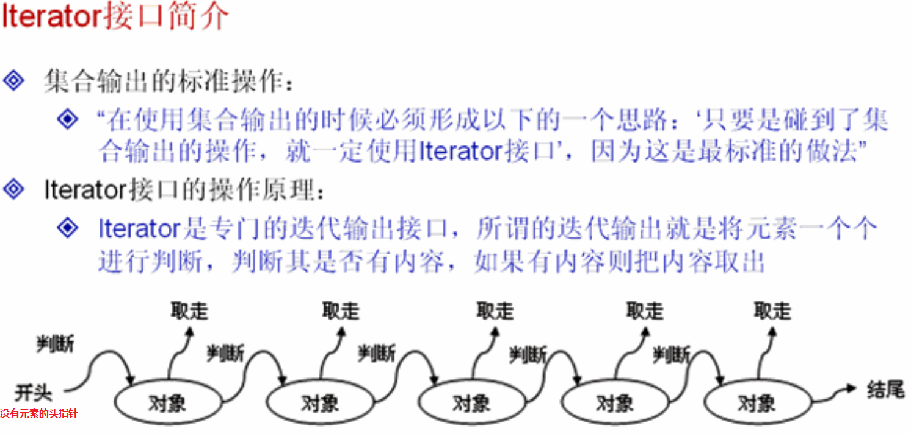
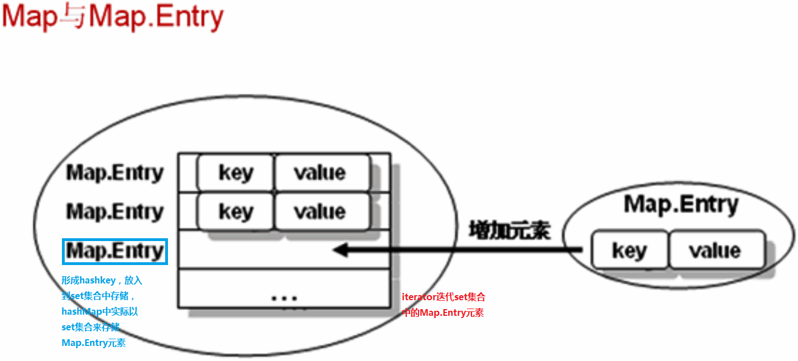

#集合学习
Iterator接口的的实现原理：

例如：
```java
List<String>  list = new ArrayList<String>();
     
list.add("yang");
list.add("xin");
list.add("zhao");

Iterator<String> iterator = list.iterator();
while (iterator.hasNext()){
    String  key = iterator.next();
    if (key == "xin"){
        iterator.remove();
    } else {
        System.out.println("key :" + key);
    }
}
```
在删除元素的时候注意，不能使用ArrayList类似的类中的remove方法，不远在iterator迭代输出的时候   
出现异常。


HashMap的实现原理

HashMap实现迭代的三种方式：
```java
Map<String,String> map = new HashMap<String, String>();

map.put("yang","18");
map.put("xin","19");
map.put("zhao","20");
//第一种  iterator迭代
Set<Map.Entry<String,String>> set = map.entrySet();
Iterator<Map.Entry<String,String>> iterator = set.iterator();
while (iterator.hasNext()){
    Map.Entry<String,String> entry = iterator.next();
    System.out.println("key: " + entry.getKey() + " value: " + entry.getValue());
}

//第二种迭代 for
for (Map.Entry<String,String> entry : map.entrySet()){
    System.out.println("key: " + entry.getKey() + " value: " + entry.getValue());
}

//第三种迭代方式 整体iterator
Iterator key = map.entrySet().iterator();
while (iterator.hasNext()){
    Map.Entry<String,String> entry = iterator.next();
    System.out.println("key: " + entry.getKey() + " value: " + entry.getValue());
}

//第四种迭代方式 单个元素的iterator
Set<String> keys = map.keySet();
Iterator<String> iterator1 = keys.iterator();
while (iterator1.hasNext()){
    String temp = iterator1.next();
    String value = map.get(temp);
    System.out.println("key: " + temp + " value: " + value);
}
```
其中第三种方式最好，最容易理解。

集合对象中插入的元素为非原始对象，则需要复写对象的hashCode和equals方法。
如果2个对象通过equals调用后返回是true，那么这个2个对象的hashCode方法也必须返回同样的int型散列码，
如果2个对象通过equals返回false，他们的hashCode返回的值允许相同。
