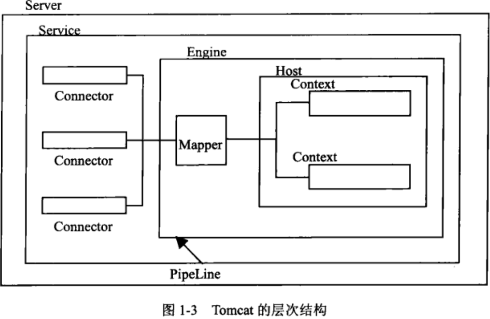
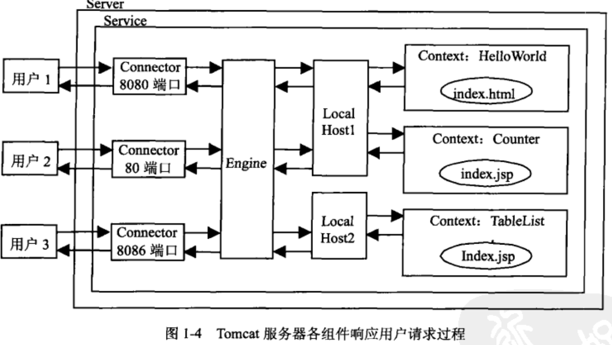

#tomcat 学习

* tomcat 请求相应图

    上图对应的server.xml文件中
```xml
<Server>
	<Service>
		<Connector/>
		<Engine>
			<Host>
				<Context>
				</Context>
			</Host>
		</Engine>
	</Service>
</Server>

```
例如如下的请求连接:  
helloWorld: http://localhost1:8080/HelloWorld/index.html  
Coneter: http://localhost1:80/Counter/index.jsp  
TableList: http://localhost2:8086/TableList/index.jsp  
3个用户分别访问上述3个不同的url，则tomcat相应的路程图如下所示：

***
